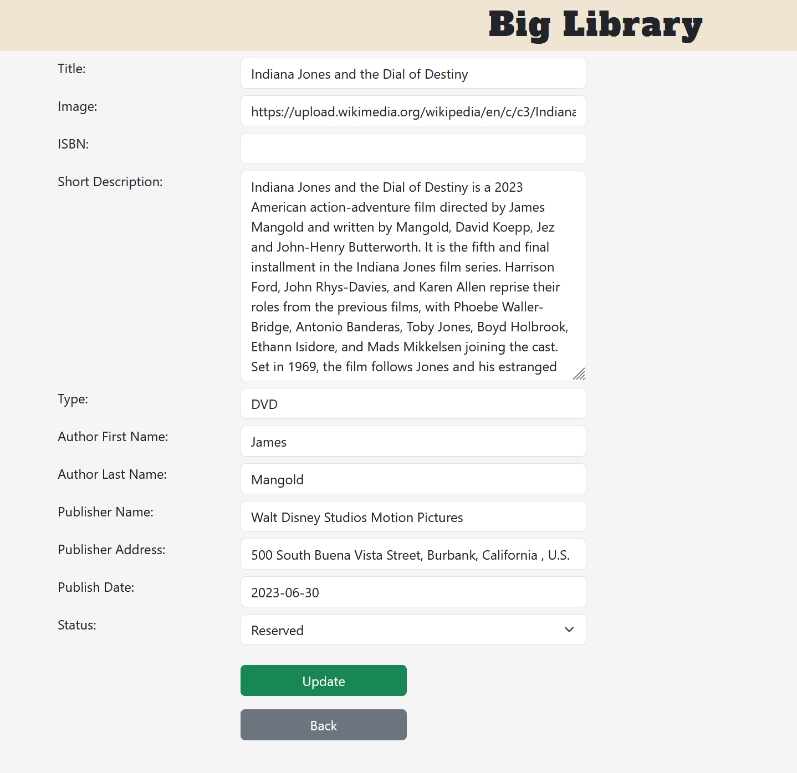

# Big Library

A web app built with PHP and MySQL that lets users manage media (Books, DVDs, CDs).

## Features

- List of media with cover images and details
- Add, edit, delete, and view details of media
- Search and filter through the library
- Simple, clean interface using Bootstrap
- Delete confirm modal

## Setup

1. Install XAMPP
2. Copy the website folder into the htdocs directory
3. Open phpMyAdmin and import the big_library.sql file
4. Visit http://localhost/website in your browser

## Screenshots

<table>
  <tr>
    <td colspan="2">
      
    </td>
  </tr>
  <tr>
    <td colspan="2">
      
    </td>
  </tr>
  <tr>
    <td colspan="2">
      
    </td>
  </tr>
  <tr>
    <td>
      
    </td>
    <td>
      
    </td>
  </tr>
  <tr>
    <td colspan="2">
      
    </td>
  </tr>
</table>
